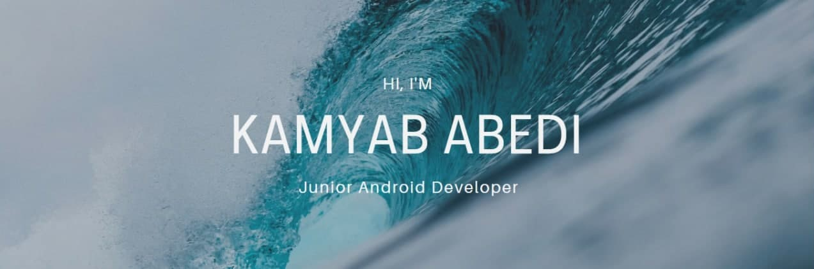

### Hi there! 👋🏻
I’m Kamyab, I’m third year student of CE at Shahid Beheshti University and interested in Back-end programming, IT security, testing and other geek stuff. 
Want to know more about me? [Check out my portfolio.](https://KamyabAbedi.github.io/)

---
### 💼 Skills

<!--
### 📌 Pinned Repositories

 

-->
---

    
<b>📈 GitHub Stats</b>

   

  

    
<b>📫 How to reach me</b>

	
    
	
	
	

<!--
**KamyabAbedi/KamyabAbedi** is a ✨ _special_ ✨ repository because its `README.md` (this file) appears on your GitHub profile.

Here are some ideas to get you started:

- 🔭 I’m currently working on ...
- 🌱 I’m currently learning ...
- 👯 I’m looking to collaborate on ...
- 🤔 I’m looking for help with ...
- 💬 Ask me about ...
- 📫 How to reach me: ...
- 😄 Pronouns: ...
- ⚡ Fun fact: ...
-->
